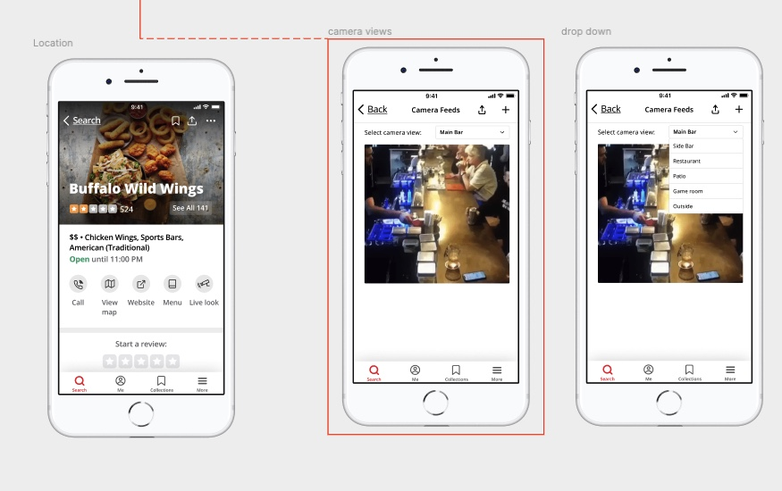
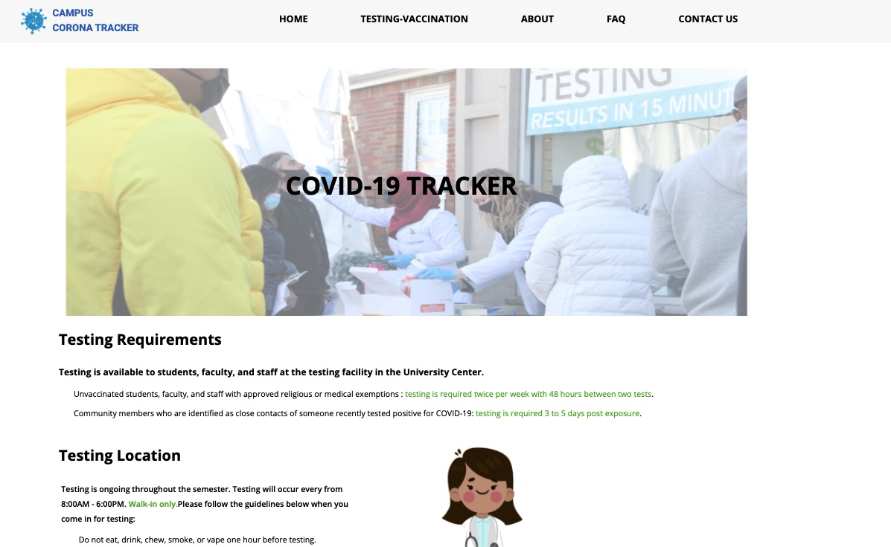
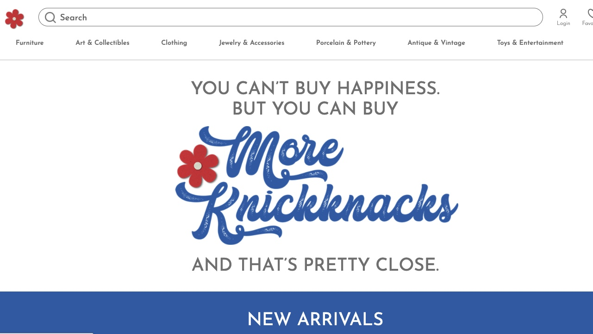

+++
title = "Showcasing Some Final Projects from Our 2021 Session"
date = 2022-01-29T12:13:40Z
draft = false
tags = ['blog']
+++

At the end of our inaugural 2021 session, participants created final projects
that reflected their newly-acquired skills as well as their incredible
persistence, dedication and creativity. Please scroll down to learn about a few
of them.

## Live Look

Team: Michael Bostick 
[Design Board](https://www.figma.com/file/HxsYe8XaKV7mtHlI2WxxoO/Design-Board?node-id=53%3A648)

Michael joined Reskill Americans with experience in the restaurant industry. His
demo project, Live Look, allows users to view live surveillance footage of
restaurants and other businesses to inform their decision-making better. The
feature offers transparency on the things customers want to know, like how busy
a restaurant is or how the kitchen operates. Michael developed Live Look to
integrate into Yelp’s existing design and envisions that the feature can be
seamlessly integrated into other apps as well. Michael’s experience with Reskill
Americans allowed him to discover his ability to work on a team, conduct
research, and problem solve. “Reskill really helped me figure out what I wanted
to do,” said Michael.

## COVID Tracker

Team: Lauren Smalls, Talisa Foster, Sharifa Nichols, Richard Jackson, Shelique Richardson 
[COVID Tracker](https://unruffled-kalam-99707e.netlify.app/)

Lauren presented the COVID Tracker project on behalf of her team. Lauren
currently works on a college campus and noticed an issue with COVID-related
communications. Her team developed a COVID Tracker that would house all the
information a student may need in one spot. The project included a real-time
look at stats, along with details regarding vaccination availability and
policies. Team members who worked on the COVID Tracker were flexible and
resilient as they learned to coordinate within time zones worldwide. The team
also expanded their skills when they unexpectedly had to play the role of
backend developer and designer.





## More Knickknacks

Team: Karl and Lorraine Boehringer 
[Knickknacks](https://kboeh.github.io/knickknacks/)

Karl and Lorraine are the husband-and-wife team behind More Knickknacks. The
idea was inspired by Karl's mother, who wants to sell her collection of antiques
after retirement. The project was a family affair: Karl and Lorraine learned how
to communicate as colleagues, working together in a designer-developer
relationship. As a first-generation student, Lorraine said that she left the
program with “confidence and enough work to build a portfolio.”




## Century Health

Team: Jarla Kornegay, Christian Villaroel, Tasha Taylor, Micheleine Beaucejour 
[Century Health](https://medical-aids-fe-1.netlify.app/index.html)

Jarla Kornegay presented The Century Health App on behalf of her team. The app
aims to find a way to grant quick access to medical information for patients.
The team’s demo included a look at the patient portal and the physician’s
portal. The final project included many features, such as a dynamic calendar,
appointment submission, and a physician schedule. Jarla said that one of the
biggest lessons she took away was “the need for persistence in finding a
solution to a problem and for sometimes testing your own instincts even if
you’re a beginner.”





